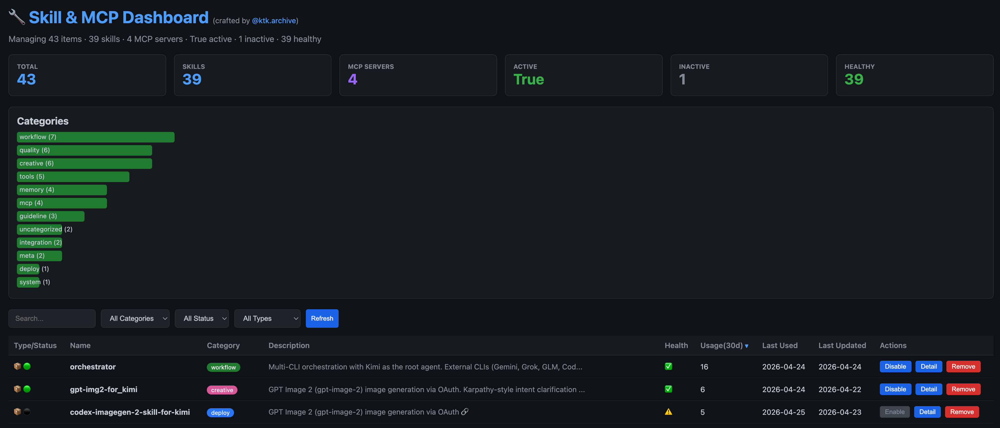

# skill-dashboard-for-kimi

A web-based dashboard for managing CLI skills and MCP servers. Originally built for [Kimi CLI](https://github.com/moonshot-ai/Kimi-CLI), but designed to work with Claude Code, Codex CLI, OpenCode CLI, or any CLI that stores skills as markdown files with YAML frontmatter.



## Features

- **Unified Table**: View all skills and MCP servers in one sortable, filterable table
- **Health Check**: Automatically validates SKILL.md existence, YAML frontmatter, and description fields
- **Activation Control**: Enable/disable skills and MCP servers with one click
- **Inline Editing**: Edit category, description, and URL directly from the detail modal
- **Safe Removal**: Delete skills with a confirmation dialog (type "remove" to confirm)
- **Category Distribution**: Visual bar chart showing skill categories
- **Cross-CLI**: Works with Kimi, Claude Code, Codex CLI, and OpenCode CLI

## Requirements

- Python 3.10+
- Modern web browser

## Installation

### Option A: Kimi CLI Skill (Recommended)

```bash
cd ~/.kimi/skills/
git clone https://github.com/ktkarchive/skill-dashboard-for-kimi.git
```

Then tell Kimi:

> "Launch the skill dashboard"

Kimi will run `scripts/skill_dashboard.py` and open your browser.

### Option B: Standalone

```bash
git clone https://github.com/ktkarchive/skill-dashboard-for-kimi.git
cd skill-dashboard-for-kimi
python3 scripts/skill_dashboard.py --port 8080 --open
```

## Usage

Once the server is running (default: `http://localhost:8080`):

### 1. Browse the Dashboard
Open your web browser and navigate to the URL shown in the terminal (e.g., `http://localhost:8080`). You will see:
- **Statistics cards** at the top (Total, Skills, MCP Servers, Active, Inactive, Healthy)
- **Category chart** showing the distribution of your skills
- **Main table** listing all skills and MCP servers

### 2. Search and Filter
- Use the **Search** box to filter by name
- Use the **Category** dropdown to filter by category
- Use the **Status** dropdown to show only Active or Inactive items
- Use the **Type** dropdown to show only Skills or MCP Servers

### 3. Sort
Click any column header to sort the table:
- **Name**, **Category**, **Description**, **Health**, **Last Used**, **Last Updated**
- Click again to toggle between ascending and descending order

### 4. Activate / Deactivate
- Click **Disable** to mark a skill or MCP server as inactive
- Click **Enable** to reactivate it
- Inactive items appear with a ⚫ status badge and a grayed-out button

### 5. Edit Metadata
- Click **Detail** on any row
- Edit **Category**, **Description**, or **URL** in the modal
- Click **Save** to apply changes immediately without reloading the page
- If a URL is set, a 🔗 link emoji appears next to the description in the table

### 6. Remove a Skill
- Click **Remove** on a skill row (not available for MCP servers)
- Read the warning message
- Type exactly `remove` in the input box
- Click **Confirm Remove** to permanently delete the skill directory
- Click **Cancel** or type anything else to abort

### 7. Refresh
Click the **Refresh** button to rescan the skills directory and MCP config and reload the table.

## Cross-CLI Setup

The script uses Kimi CLI paths by default. To use with another CLI, uncomment the appropriate block at the top of `scripts/skill_dashboard.py`:

```python
# Kimi CLI (default):
SKILLS_DIR = Path.home() / ".kimi" / "skills"
MCP_JSON = Path.home() / ".kimi" / "mcp.json"

# Claude Code:
# SKILLS_DIR = Path.home() / ".claude" / "skills"
# MCP_JSON = Path.home() / ".claude" / "mcp.json"

# Codex CLI:
# SKILLS_DIR = Path.home() / ".codex" / "skills"
# MCP_JSON = Path.home() / ".codex" / "mcp.json"
```

## Dashboard UI

### Statistics Cards
- Total items, Skills, MCP Servers, Active, Inactive, Healthy

### Category Chart
- Horizontal bar chart showing distribution of skill categories

### Table Columns
| Column | Description |
|--------|-------------|
| Type/Status | Skill (📦) or MCP (🤖), Active (🟢) or Inactive (⚫) |
| Name | Skill/MCP name |
| Category | Colored category badge |
| Description | Truncated description with 🔗 link if URL is set |
| Health | ✅ Healthy or ⚠️ Issues |
| Last Used | Date of last usage |
| Last Updated | Date of last file modification |
| Actions | Disable/Enable, Detail, Remove |

### Detail Modal
Click **Detail** to view and edit:
- Category
- Description
- URL (displays 🔗 link emoji in table when set)
- Health status and issues
- References count (skills)
- Command/Args/Env vars (MCP servers — env values are masked)
- Tags
- File path

### Remove Confirmation
Click **Remove** on a skill row to trigger a confirmation dialog. Type exactly `remove` to permanently delete the skill directory. MCP servers cannot be removed from the dashboard.

## API Endpoints

| Method | Endpoint | Description |
|--------|----------|-------------|
| GET | `/` | HTML dashboard |
| GET | `/api/skills` | JSON skill list |
| GET | `/api/mcp` | JSON MCP server list |
| GET | `/api/stats` | JSON statistics |
| POST | `/api/skills/{name}/toggle` | Toggle skill active state |
| POST | `/api/mcp/{name}/toggle` | Toggle MCP server active state |
| POST | `/api/skills/{name}/update` | Update skill metadata (category, description, url) |
| POST | `/api/mcp/{name}/update` | Update MCP metadata (category, description, url) |
| POST | `/api/skills/{name}/remove` | Permanently delete a skill |

## CLI Options

```bash
python3 scripts/skill_dashboard.py --port 8080 --open
```

| Flag | Description |
|------|-------------|
| `--port` | Server port (default: 8080) |
| `--open` | Auto-open browser |
| `--scan` | Scan and list all items, then exit |
| `--health` | Run health check and exit |

## Data Storage

- **Skills**: Read from `SKILLS_DIR/*/SKILL.md`
- **MCP Servers**: Read from `MCP_JSON` (usually `mcp.json`)
- **Registry**: Local state stored in `SKILLS_DIR/.skill-registry.json`
  - Tracks active/inactive state
  - Stores edited metadata (category, description, url)
- **No external data collection**: All data stays on your local machine

## Troubleshooting

| Problem | Solution |
|---------|----------|
| "Port already in use" | Use `--port 9000` or kill the existing process |
| Skills not showing | Check that `SKILLS_DIR` points to the correct path |
| MCP servers not showing | Check that `MCP_JSON` file exists and is valid JSON |
| Changes not saving | Ensure the registry file is writable |

## License

MIT
